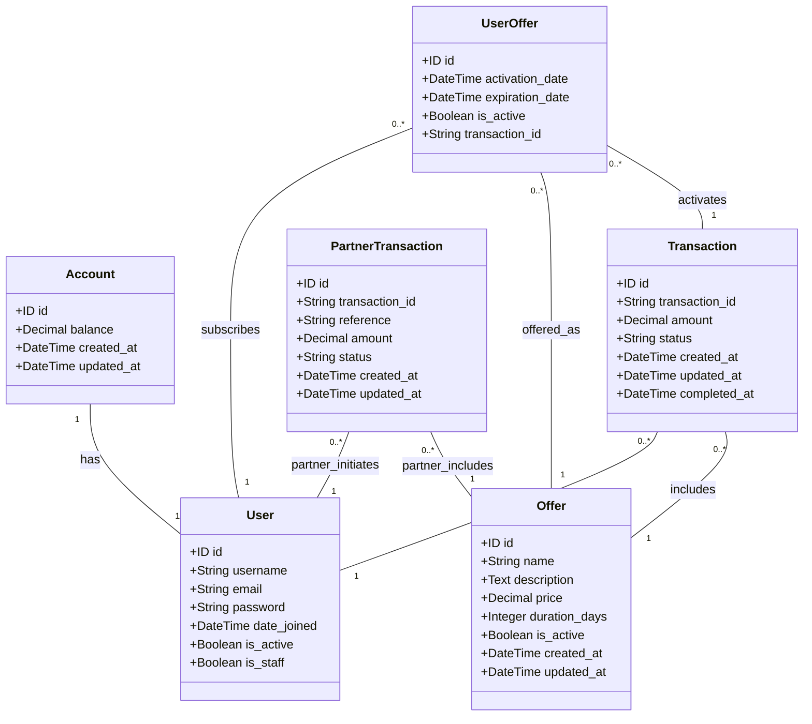

# Class Diagram

This diagram shows all the models and their relationships in the Offers API system.

```mermaid
classDiagram
    %% Classes
    class User {
        +id
        +username
        +email
        +password
        +first_name
        +last_name
        +is_active
        +is_staff
        +is_superuser
        +date_joined
        +last_login
    }
    
    class Account {
        +id
        +balance
        +created_at
        +updated_at
    }
    
    class Offer {
        +id
        +name
        +description
        +price
        +duration_days
        +is_active
        +created_at
        +updated_at
    }
    
    class UserOffer {
        +id
        +activation_date
        +expiration_date
        +is_active
        +transaction_id
    }
    
    class Transaction {
        +id
        +transaction_id
        +amount
        +status
        +created_at
        +updated_at
        +completed_at
    }
    
    class PartnerTransaction {
        +id
        +transaction_id
        +amount
        +status
        +reference
        +created_at
        +updated_at
    }
    
    %% Relationships
    User "1" -- "1" Account : has
    User "1" -- "0..*" Transaction : makes
    User "1" -- "0..*" UserOffer : activates
    Offer "1" -- "0..*" UserOffer : included in
    Offer "1" -- "0..*" Transaction : associated with
    Transaction "1" -- "1" UserOffer : creates
    User "1" -- "0..*" PartnerTransaction : validates
    Offer "1" -- "0..*" PartnerTransaction : associated with
    
    %% Enumerations
    class TransactionStatusEnum {
        <<enumeration>>
        PENDING
        PROCESSING
        SUCCESS
        FAILED
    }
    
    Transaction --> TransactionStatusEnum : has status
    
    %% Notes
    note right of Account
        Stores user's financial balance
    end note
    
    note right of Offer
        Represents an offer that can be activated
    end note
    
    note right of UserOffer
        Tracks activated offers for users
    end note
    
    note right of Transaction
        Records financial transactions for offer activation
    end note
    
    note right of PartnerTransaction
        Stores partner transaction references for validation
    end note
```
# Model Class Diagram

This document provides a comprehensive class diagram for all models in the Offers API system, showing their relationships and attributes.

## Class Diagram



## Model Descriptions

### User (Django Built-in Model)

The standard Django User model represents a user account in the system.

**Attributes:**
- `id` (ID): Unique identifier for the user
- `username` (String): Unique username for the user
- `email` (String): User's email address
- `password` (String): Hashed password
- `date_joined` (DateTime): When the user registered
- `is_active` (Boolean): Whether the user account is active
- `is_staff` (Boolean): Whether the user can access admin interface

### Account

Represents a user's account with financial balance information.

**Attributes:**
- `id` (ID): Unique identifier for the account
- `user` (User): One-to-one relationship with the User model
- `balance` (Decimal): Current account balance
- `created_at` (DateTime): When the account was created
- `updated_at` (DateTime): When the account was last updated

### Offer

Represents a subscription offer (e.g., Internet, TV package).

**Attributes:**
- `id` (ID): Unique identifier for the offer
- `name` (String): Name of the offer
- `description` (Text): Detailed description of the offer
- `price` (Decimal): Cost of the offer
- `duration_days` (Integer): How long the offer lasts in days
- `is_active` (Boolean): Whether the offer is currently available
- `created_at` (DateTime): When the offer was created
- `updated_at` (DateTime): When the offer was last updated

### UserOffer

Represents an active subscription for a user.

**Attributes:**
- `id` (ID): Unique identifier for the user offer
- `user` (User): Foreign key to the User who subscribed
- `offer` (Offer): Foreign key to the subscribed Offer
- `activation_date` (DateTime): When the subscription was activated
- `expiration_date` (DateTime): When the subscription expires
- `is_active` (Boolean): Whether the subscription is currently active
- `transaction_id` (String): Unique identifier linking to the activation transaction

### Transaction

Represents a financial transaction for offer activation.

**Attributes:**
- `id` (ID): Unique identifier for the transaction
- `user` (User): Foreign key to the User who initiated the transaction
- `offer` (Offer): Foreign key to the Offer being purchased
- `transaction_id` (String): Unique identifier for the transaction
- `amount` (Decimal): Amount charged for the transaction
- `status` (String): Current status (PENDING, PROCESSING, SUCCESS, FAILED)
- `created_at` (DateTime): When the transaction was created
- `updated_at` (DateTime): When the transaction was last updated
- `completed_at` (DateTime): When the transaction was completed (nullable)

### PartnerTransaction

Represents a transaction initiated by a partner system.

**Attributes:**
- `id` (ID): Unique identifier for the partner transaction
- `transaction_id` (String): Unique identifier for the transaction
- `reference` (String): Unique reference number for partner validation
- `user` (User): Foreign key to the User for whom the transaction is initiated
- `offer` (Offer): Foreign key to the Offer being purchased
- `amount` (Decimal): Amount for the transaction
- `status` (String): Current status (PENDING, PROCESSING, SUCCESS, FAILED)
- `created_at` (DateTime): When the transaction was created
- `updated_at` (DateTime): When the transaction was last updated

## Relationship Summary

1. **User to Account**: One-to-One relationship - Each user has exactly one account
2. **User to Transaction**: One-to-Many relationship - A user can have multiple transactions
3. **User to UserOffer**: One-to-Many relationship - A user can subscribe to multiple offers
4. **User to PartnerTransaction**: One-to-Many relationship - A user can have multiple partner-initiated transactions
5. **Offer to Transaction**: One-to-Many relationship - An offer can be part of multiple transactions
6. **Offer to UserOffer**: One-to-Many relationship - An offer can be subscribed to by multiple users
7. **Offer to PartnerTransaction**: One-to-Many relationship - An offer can be part of multiple partner transactions
8. **Transaction to UserOffer**: One-to-Many relationship - A transaction can activate multiple user offers (though typically one-to-one in practice)

This class diagram provides a comprehensive view of the data model relationships in the Offers API system, showing how users, accounts, offers, and transactions are interconnected.