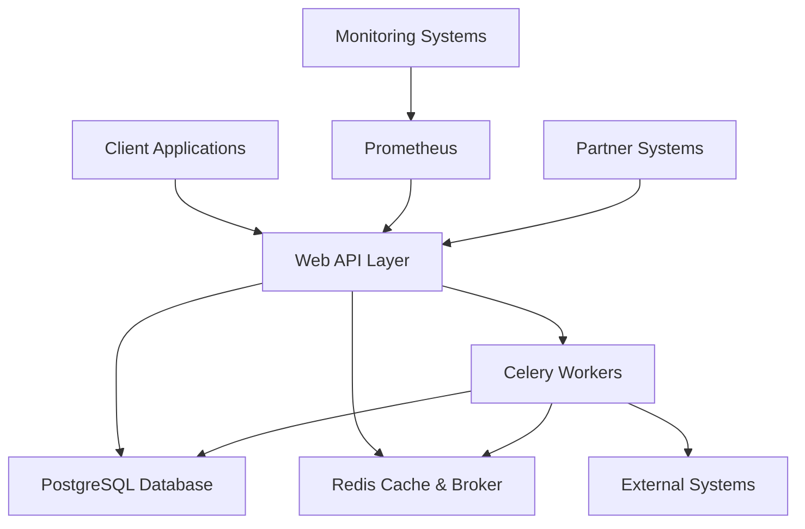

# Offers API

A high-performance, scalable RESTful API for managing subscription bundles (Internet, TV, etc.) with asynchronous activation and transaction tracking.

## Table of Contents

- [Overview](#overview)
- [Key Features](#key-features)
- [Technology Stack](#technology-stack)
- [Architecture](#architecture)
- [Documentation](#documentation)
- [Getting Started](#getting-started)
- [API Endpoints](#api-endpoints)
- [Testing](#testing)
- [Deployment](#deployment)

## Overview

The Offers API provides a complete solution for managing subscription offers with features like user authentication, offer browsing, account management, and asynchronous activation processing. The system is designed for telecom/media service providers who need a robust platform for handling customer subscriptions.

## Key Features

- **User Authentication**: JWT-based authentication with refresh tokens
- **Offer Management**: Browse and select from available subscription offers
- **Account Management**: Balance checking and subscription management
- **Asynchronous Activation**: Celery-based background processing for offer activation
- **Real-time Status Tracking**: Redis-backed transaction status checking
- **Notifications**: Email notifications for activation status and expiring offers
- **Partner Integration**: Dedicated API for partner systems to initiate activations
- **Caching**: Redis caching for improved performance
- **Monitoring**: Prometheus metrics and Grafana dashboards

## Technology Stack

- **Backend**: Django 5.0 + Django REST Framework 3.14
- **Database**: PostgreSQL
- **Cache & Message Broker**: Redis 7.0
- **Asynchronous Tasks**: Celery 5.3
- **API Documentation**: drf-yasg (Swagger/OpenAPI)
- **Testing**: pytest 7.0 + pytest-django 4.5
- **Deployment**: Docker & Docker Compose
- **Monitoring**: Prometheus + Grafana

## Architecture



For a detailed architecture diagram and flowcharts of all system processes, see [SYSTEM_FLOWCHARTS.md](SYSTEM_FLOWCHARTS.md).

## Documentation

- [User Guide](USER_GUIDE.md) - Complete guide for API users
- [Technical Documentation](TECHNICAL_DOC.md) - In-depth technical implementation details
- [System Flowcharts](SYSTEM_FLOWCHARTS.md) - Detailed flowcharts for all processes
- [Postman Guide](POSTMAN_GUIDE.md) - Instructions for using the Postman collection
- [API Reference](http://localhost:8000/swagger/) - Interactive API documentation (when running)

## Getting Started

### Prerequisites

- Docker & Docker Compose
- Python 3.8+ (for local development)
- PostgreSQL (for local development)
- Redis (for local development)

### Quick Start with Docker

1. Clone the repository:
   ```
   git clone <repository-url>
   cd offers-api
   ```

2. Configure environment variables:
   ```
   cp .env.example .env
   # Edit .env with your configuration
   ```

3. Start the services:
   ```
   docker-compose up -d --build
   ```

4. Run database migrations:
   ```
   docker-compose exec web python manage.py migrate
   ```

5. Create a superuser (optional):
   ```
   docker-compose exec web python manage.py createsuperuser
   ```

6. Seed the database with test data (optional):
   ```
   docker-compose exec web python manage.py seed
   ```

The API will be available at `http://localhost:8000`

### Local Development Setup

1. Create a virtual environment:
   ```
   python -m venv venv
   source venv/bin/activate  # On Windows: venv\Scripts\activate
   ```

2. Install dependencies:
   ```
   pip install -r requirements.txt
   ```

3. Configure environment variables:
   ```
   cp .env.example .env
   # Edit .env with your configuration
   ```

4. Run database migrations:
   ```
   python manage.py migrate
   ```

5. Start the development server:
   ```
   python manage.py runserver
   ```

6. In a separate terminal, start Celery worker:
   ```
   celery -A config worker --loglevel=info
   ```

7. In another terminal, start Celery beat (for scheduled tasks):
   ```
   celery -A config beat --loglevel=info
   ```

## API Endpoints

### Authentication
- `POST /api/v1/auth/login/` - User login
- `GET /api/v1/auth/profile/` - Get user profile
- `POST /api/v1/auth/refresh/` - Refresh access token
- `POST /api/v1/auth/logout/` - User logout

### Offers
- `GET /api/v1/offers/` - List all offers
- `GET /api/v1/offers/{id}/` - Get specific offer details
- `GET /api/v1/offers/expiring/` - Get user's expiring offers
- `POST /api/v1/offers/renew/` - Renew an offer

### Account
- `GET /api/v1/account/balance/` - Get account balance
- `GET /api/v1/account/subscriptions/` - Get user subscriptions
- `GET /api/v1/account/transactions/` - List transactions
- `GET /api/v1/account/transactions/{id}/` - Get transaction details

### Activation
- `POST /api/v1/activation/` - Activate an offer
- `GET /api/v1/activation/status/{id}/` - Check activation status

### Partner
- `POST /api/v1/partner/activate/` - Partner activation request
- `GET /api/v1/partner/validate/{reference}/` - Validate transaction by reference

For detailed API documentation, visit the Swagger UI at `http://localhost:8000/swagger/` when the application is running.

## Testing

### Running Tests with Docker

```
./run_tests.bat
```

### Running Tests Manually

```
docker-compose exec web pytest
```

### Test Coverage

To generate a coverage report:

```
docker-compose exec web coverage run -m pytest
docker-compose exec web coverage report
docker-compose exec web coverage html
```

The HTML coverage report will be available in the `htmlcov/` directory.

## Deployment

### Production Deployment

1. Update environment variables in `docker-compose.yml` for production
2. Build and start services:
   ```
   docker-compose -f docker-compose.yml up -d --build
   ```
3. Run migrations:
   ```
   docker-compose exec web python manage.py migrate
   ```
4. Create superuser:
   ```
   docker-compose exec web python manage.py createsuperuser
   ```

### Environment Variables

Key environment variables that need to be configured:

- `SECRET_KEY` - Django secret key
- `DEBUG` - Debug mode (False for production)
- `DB_NAME`, `DB_USER`, `DB_PASSWORD`, `DB_HOST`, `DB_PORT` - Database configuration
- `REDIS_HOST`, `REDIS_PORT` - Redis configuration
- `CELERY_BROKER_URL` - Celery broker URL

See [.env.example](.env.example) for a complete list of required environment variables.

## Contributing

1. Fork the repository
2. Create your feature branch (`git checkout -b feature/AmazingFeature`)
3. Commit your changes (`git commit -m 'Add some AmazingFeature'`)
4. Push to the branch (`git push origin feature/AmazingFeature`)
5. Open a pull request

## License

This project is licensed under the MIT License - see the [LICENSE](LICENSE) file for details.

## Support

For support, please open an issue on the GitHub repository or contact the development team.