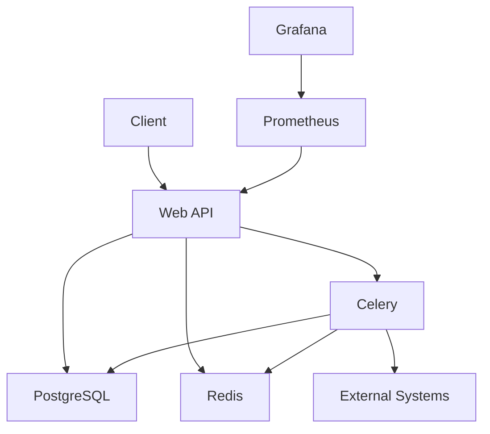

# Technical Documentation

This document provides technical details about the implementation of the Offers API system, with a focus on Redis data handling, Celery tasks, and system architecture.

## Table of Contents
1. [System Architecture](#system-architecture)
2. [Redis Implementation](#redis-implementation)
3. [Celery Tasks](#celery-tasks)
4. [Data Models](#data-models)
5. [API Endpoints](#api-endpoints)
6. [Monitoring](#monitoring)

## System Architecture

The Offers API follows a microservices-inspired architecture with the following components:



### Component Descriptions

1. **Web API (Django)**: Main application handling HTTP requests
2. **PostgreSQL**: Primary database for persistent data storage
3. **Redis**: 
   - Cache for offer data
   - Message broker for Celery
   - Transaction status storage
4. **Celery**: Asynchronous task processing
5. **External Systems**: Simulated external activation systems
6. **Prometheus**: Metrics collection
7. **Grafana**: Metrics visualization

## Redis Implementation

### Hash-based Transaction Storage

Instead of using simple string values with GET/SET operations, we use Redis hashes for storing transaction data. This approach provides several benefits:

1. **Structured Data Storage**: Each field can be accessed individually
2. **Efficient Updates**: Only changed fields need to be updated
3. **Atomic Operations**: HSET and HGETALL operations are atomic
4. **Memory Efficiency**: More efficient than serialized JSON strings

### Implementation Details

#### Storing Transactions

```python
# In activation/views.py
transaction_data = {
    'transaction_id': str(transaction_id),
    'user_id': str(request.user.id),
    'offer_id': str(offer.id),
    'amount': str(offer.price),
    'status': 'PENDING',
    'created_at': str(timezone.now()),
    'updated_at': str(timezone.now())
}

# Using HSET with mapping to store the entire hash
redis_client.hset(f"transaction:{transaction_id}", mapping=transaction_data)
```

#### Updating Transaction Status

```python
# In activation/tasks.py
# Update only the status and updated_at fields
redis_client.hset(f"transaction:{transaction_id}", mapping={
    'status': 'SUCCESS',
    'updated_at': str(timezone.now())
})
```

#### Retrieving Transaction Data

```python
# In activation/views.py
# Retrieve all fields with HGETALL
transaction_data = redis_client.hgetall(f"transaction:{transaction_id}")
```

### Advantages over String-based Storage

#### Traditional String Approach (Not Used)
```python
# This approach is NOT used in our implementation
import json

# Storing
transaction_data = {
    'transaction_id': str(transaction_id),
    'user_id': str(request.user.id),
    'offer_id': str(offer.id),
    'amount': str(offer.price),
    'status': 'PENDING',
    'created_at': str(timezone.now())
}
redis_client.set(f"transaction:{transaction_id}", json.dumps(transaction_data))

# Retrieving
transaction_json = redis_client.get(f"transaction:{transaction_id}")
transaction_data = json.loads(transaction_json)

# Updating (requires retrieving, modifying, and storing entire object)
transaction_data = json.loads(redis_client.get(f"transaction:{transaction_id}"))
transaction_data['status'] = 'SUCCESS'
redis_client.set(f"transaction:{transaction_id}", json.dumps(transaction_data))
```

#### Hash Approach (Used in Implementation)
```python
# This is the approach we use
# Storing
redis_client.hset(f"transaction:{transaction_id}", mapping=transaction_data)

# Retrieving
transaction_data = redis_client.hgetall(f"transaction:{transaction_id}")

# Updating (only modified fields)
redis_client.hset(f"transaction:{transaction_id}", 'status', 'SUCCESS')
```

### Redis Key Naming Convention

All Redis keys follow a consistent naming pattern:
- `transaction:<uuid>` - Transaction data stored as hashes
- `offer:<id>` - Cached offer data
- `user:<id>:balance` - User balance

### Redis Configuration

The Redis connection is configured directly in the modules that need it:

```python
import redis
import os

# Redis connection
redis_client = redis.Redis(
    host=os.environ.get('REDIS_HOST', 'localhost'),
    port=os.environ.get('REDIS_PORT', '6379'),
    db=int(os.environ.get('REDIS_DB', '0')),
    decode_responses=True
)
```

## Celery Tasks

### Process Activation Task

The main activation task is implemented in [activation/tasks.py](file:///c%3A/Users/alain/Pictures/Offers%20API/activation/tasks.py):

```python
@shared_task(bind=True, autoretry_for=(Exception,), retry_kwargs={'max_retries': 3})
def process_activation(transaction_id):
    start_time = time.time()
    
    try:
        # Get the transaction
        transaction = Transaction.objects.get(transaction_id=transaction_id)
        
        # Update status to PROCESSING
        transaction.status = 'PROCESSING'
        transaction.save()
        
        # Update Redis cache
        redis_client.hset(f"transaction:{transaction_id}", mapping={
            'status': 'PROCESSING',
            'updated_at': str(timezone.now())
        })
        
        # Simulate external system call for activation
        activation_result = activate_offer_in_external_system(transaction)
        
        if activation_result:
            # Success case
            transaction.status = 'SUCCESS'
            transaction.completed_at = timezone.now()
            transaction.save()
            
            # Update Redis cache
            redis_client.hset(f"transaction:{transaction_id}", mapping={
                'status': 'SUCCESS',
                'updated_at': str(timezone.now())
            })
            
            # Activate the user offer
            try:
                user_offer = UserOffer.objects.get(transaction_id=transaction_id)
                user_offer.is_active = True
                user_offer.save()
            except UserOffer.DoesNotExist:
                logger.error(f"UserOffer not found for transaction {transaction_id}")
                track_activation('failed', start_time)
        else:
            # Failure case
            transaction.status = 'FAILED'
            transaction.completed_at = timezone.now()
            transaction.save()
            
            # Update Redis cache
            redis_client.hset(f"transaction:{transaction_id}", mapping={
                'status': 'FAILED',
                'updated_at': str(timezone.now())
            })
            
            # Refund the user
            from account.models import Account
            account, created = Account.objects.get_or_create(user=transaction.user)
            account.balance += transaction.amount
            account.save()
            
        return f"Activation processed with status: {transaction.status}"
        
    except Transaction.DoesNotExist:
        logger.error(f"Transaction {transaction_id} not found")
        # Update Redis cache
        redis_client.hset(f"transaction:{transaction_id}", mapping={
            'status': 'FAILED',
            'updated_at': str(timezone.now())
        })
        return f"Transaction {transaction_id} not found"
    except Exception as e:
        logger.error(f"Error processing activation {transaction_id}: {str(e)}")
        # Update Redis cache
        redis_client.hset(f"transaction:{transaction_id}", mapping={
            'status': 'FAILED',
            'updated_at': str(timezone.now())
        })
        
        # Update transaction status to FAILED in case of exception
        try:
            transaction = Transaction.objects.get(transaction_id=transaction_id)
            transaction.status = 'FAILED'
            transaction.completed_at = timezone.now()
            transaction.save()
        except Transaction.DoesNotExist:
            pass
        return f"Error processing activation: {str(e)}"
```

### Task Routing

Celery is configured in [config/celery.py](file:///c%3A/Users/alain/Pictures/Offers%20API/config/celery.py):

```python
import os
from celery import Celery

# Set the default Django settings module for the 'celery' program.
os.environ.setdefault('DJANGO_SETTINGS_MODULE', 'config.base')

app = Celery('offers_api')

# Using a string here means the worker doesn't have to serialize
# the configuration object to child processes.
# - namespace='CELERY' means all celery-related configuration keys
#   should have a `CELERY_` prefix.
app.config_from_object('django.conf:settings', namespace='CELERY')

# Load task modules from all registered Django apps.
app.autodiscover_tasks()
```

## Data Models

### User Model
The default Django user model is used for authentication.

### Account Model
```python
class Account(models.Model):
    user = models.OneToOneField(User, on_delete=models.CASCADE)
    balance = models.DecimalField(max_digits=10, decimal_places=2, default=0.00)
```

### Offer Model
```python
class Offer(models.Model):
    name = models.CharField(max_length=255)
    price = models.DecimalField(max_digits=10, decimal_places=2)
    duration_days = models.IntegerField()
    created_at = models.DateTimeField(auto_now_add=True)
    updated_at = models.DateTimeField(auto_now=True)
```

### Transaction Model
```python
class Transaction(models.Model):
    STATUS_CHOICES = [
        ('PENDING', 'Pending'),
        ('PROCESSING', 'Processing'),
        ('SUCCESS', 'Success'),
        ('FAILED', 'Failed'),
    ]
    
    user = models.ForeignKey(User, on_delete=models.CASCADE)
    offer = models.ForeignKey(Offer, on_delete=models.CASCADE)
    transaction_id = models.UUIDField(default=uuid.uuid4, editable=False, unique=True)
    amount = models.DecimalField(max_digits=10, decimal_places=2)
    status = models.CharField(max_length=20, choices=STATUS_CHOICES, default='PENDING')
    created_at = models.DateTimeField(auto_now_add=True)
    updated_at = models.DateTimeField(auto_now=True)
    completed_at = models.DateTimeField(null=True, blank=True)
```

### UserOffer Model
```python
class UserOffer(models.Model):
    user = models.ForeignKey(User, on_delete=models.CASCADE)
    offer = models.ForeignKey(Offer, on_delete=models.CASCADE)
    transaction_id = models.UUIDField()
    is_active = models.BooleanField(default=False)
    expiration_date = models.DateTimeField()
    created_at = models.DateTimeField(auto_now_add=True)
```

## API Endpoints

### Authentication
- `POST /api/v1/auth/login/` - User login
- `POST /api/v1/auth/refresh/` - Refresh access token
- `POST /api/v1/auth/logout/` - Logout user
- `GET /api/v1/auth/profile/` - Get user profile

### Offers
- `GET /api/v1/offers/` - List all offers
- `GET /api/v1/offers/{id}/` - Get offer details

### Account
- `GET /api/v1/account/` - Get account balance
- `GET /api/v1/account/transactions/` - List transactions
- `GET /api/v1/account/transactions/{id}/` - Get transaction details

### Activation
- `POST /api/v1/activation/` - Request offer activation
- `GET /api/v1/activation/status/{transaction_id}/` - Check activation status

## Monitoring

### Prometheus Metrics

The application exposes several custom metrics for monitoring:

1. `activation_requests_total` - Counter for tracking activation requests by status
2. `celery_workers` - Gauge for tracking current Celery workers
3. `activation_processing_seconds` - Histogram for tracking activation processing time

Defined in [activation/metrics.py](file:///c%3A/Users/alain/Pictures/Offers%20API/activation/metrics.py):

```python
# Counter for tracking activation requests
activation_requests_total = Counter(
    'activation_requests_total',
    'Total number of activation requests',
    ['status']
)

# Gauge for tracking current Celery workers
celery_workers = Gauge(
    'celery_workers',
    'Number of active Celery workers'
)

# Histogram for tracking activation processing time
activation_processing_time = Histogram(
    'activation_processing_seconds',
    'Time spent processing activations',
    ['status']
)
```

### Grafana Dashboard

A pre-configured Grafana dashboard is provided in [grafana/provisioning/dashboards/offers-dashboard.json](file:///c%3A/Users/alain/Pictures/Offers%20API/grafana/provisioning/dashboards/offers-dashboard.json) with panels for:

1. Activation Requests Overview
2. Activation Success Rate
3. Failed Activations (Hourly)
4. Celery Worker Status