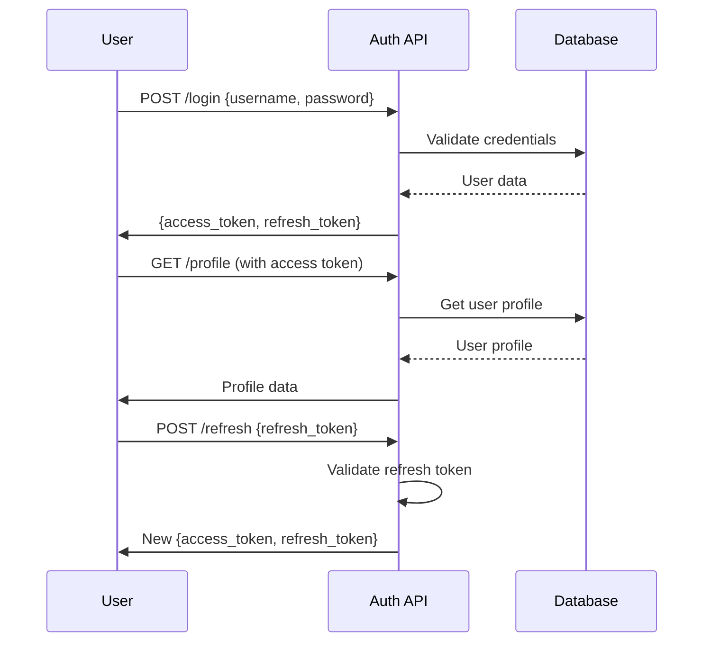
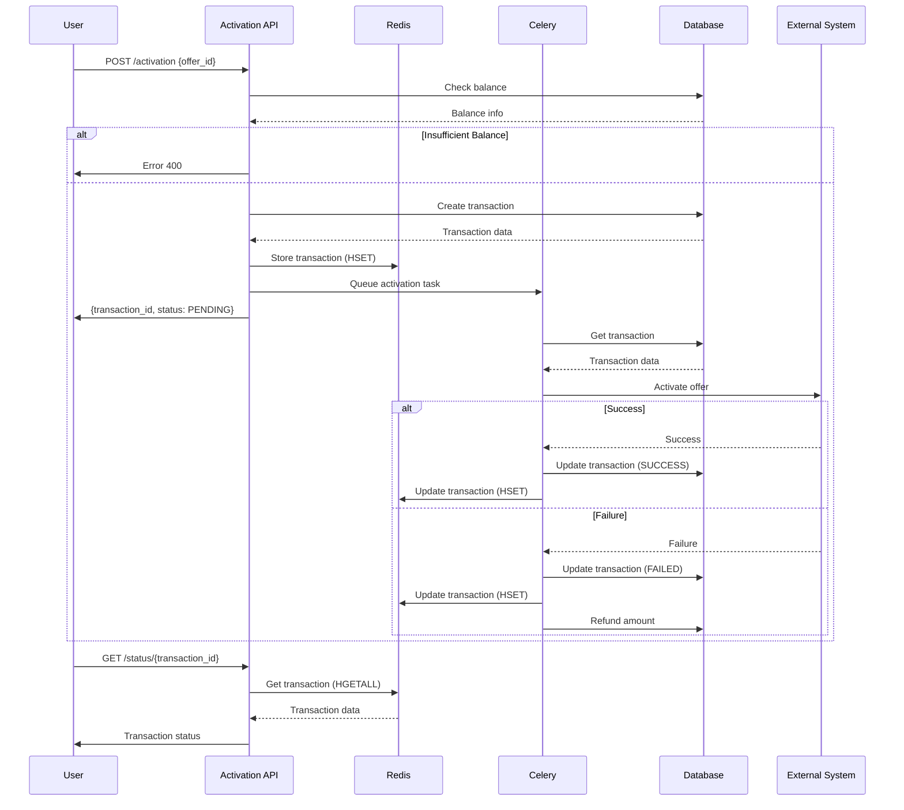
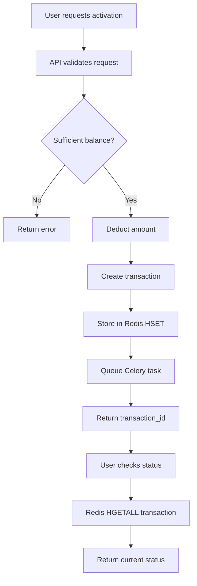

# User Guide for Offers API

This document provides detailed instructions on how to use the Offers API system, including authentication, key workflows, and implementation details.

## Table of Contents
1. [Authentication Flow](#authentication-flow)
2. [Offer Management](#offer-management)
3. [Account Management](#account-management)
4. [Activation Process](#activation-process)
5. [Implementation Flowcharts](#implementation-flowcharts)
6. [Redis Data Structure](#redis-data-structure)

## Authentication Flow

### 1. User Login
To access the API, users must first authenticate using the login endpoint:

```
POST /api/v1/auth/login/
```

Request body:
```json
{
  "username": "your_username",
  "password": "your_password"
}
```

Response:
```json
{
  "access": "access_token",
  "refresh": "refresh_token"
}
```

### 2. Using Access Token
Include the access token in the Authorization header for all subsequent requests:
```
Authorization: Bearer access_token
```

### 3. User Profile
Retrieve user profile information:
```
GET /api/v1/auth/profile/
```

### 4. Token Refresh
Refresh your access token when it expires:
```
POST /api/v1/auth/refresh/
```

Request body:
```json
{
  "refresh": "refresh_token"
}
```

### 5. User Logout
Invalidate refresh tokens:
```
POST /api/v1/auth/logout/
```

Request body:
```json
{
  "refresh": "refresh_token"
}
```

## Offer Management

### 1. List Available Offers
Retrieve all available offers:
```
GET /api/v1/offers/
```

### 2. Get Offer Details
Get details for a specific offer:
```
GET /api/v1/offers/{offer_id}/
```

## Account Management

### 1. View Account Balance
Check account balance and active subscriptions:
```
GET /api/v1/account/
```

### 2. View Transaction History
Get a list of all transactions:
```
GET /api/v1/account/transactions/
```

### 3. View Specific Transaction
Get details for a specific transaction:
```
GET /api/v1/account/transactions/{transaction_id}/
```

## Activation Process

### 1. Activate an Offer
Request activation of an offer:
```
POST /api/v1/activation/
```

Request body:
```json
{
  "offer_id": 1
}
```

Response:
```json
{
  "transaction_id": "uuid-string",
  "status": "PENDING"
}
```

### 2. Check Activation Status
Check the status of an activation request:
```
GET /api/v1/activation/status/{transaction_id}/
```

Response:
```json
{
  "transaction_id": "uuid-string",
  "status": "SUCCESS", // or "PENDING", "FAILED"
  "created_at": "timestamp",
  "updated_at": "timestamp"
}
```

## Implementation Flowcharts

Detailed flowcharts for all system processes are available in the [SYSTEM_FLOWCHARTS.md](SYSTEM_FLOWCHARTS.md) document. This includes:

1. Complete system architecture
2. User authentication flow
3. Offer management flow
4. Account management flow
5. Standard activation flow
6. Partner activation flow
7. Transaction status checking flow
8. Expiring offers notification flow
9. Error handling and recovery flows

Please refer to that document for comprehensive diagrams of all system processes.

### Authentication Flow


### Offer Activation Flow


### Transaction Processing Flow


## Redis Data Structure

The application uses Redis hashes to store transaction data efficiently. This approach allows us to store and retrieve structured data without serialization overhead.

### Transaction Storage

Instead of storing transactions as serialized strings, we use Redis hashes:

```
HSET transaction:<transaction_id> status "PENDING" amount "20.00" user_id "123" offer_id "456" created_at "timestamp"
```

To retrieve all transaction data:
```
HGETALL transaction:<transaction_id>
```

This returns a hash map:
```
{
  "status": "PENDING",
  "amount": "20.00",
  "user_id": "123",
  "offer_id": "456",
  "created_at": "timestamp",
  "updated_at": "timestamp"
}
```

### Benefits of Using HSET/HGETALL

1. **Efficient Storage**: Only modified fields need to be updated
2. **Fast Retrieval**: All transaction data retrieved in a single operation
3. **No Serialization**: Data stored as strings, no JSON parsing required
4. **Partial Updates**: Can update individual fields without affecting others

### Redis Commands Used

1. **Storing a new transaction**:
   ```
   HSET transaction:<transaction_id> status "PENDING" amount "20.00" user_id "123" offer_id "456" created_at "timestamp"
   ```

2. **Updating transaction status**:
   ```
   HSET transaction:<transaction_id> status "SUCCESS" updated_at "timestamp"
   ```

3. **Retrieving transaction data**:
   ```
   HGETALL transaction:<transaction_id>
   ```

4. **Checking specific field**:
   ```
   HGET transaction:<transaction_id> status
   ```

### Example Usage in Code

```python
# Storing transaction data
redis_client.hset(f"transaction:{transaction_id}", mapping={
    "status": "PENDING",
    "amount": str(amount),
    "user_id": str(user_id),
    "offer_id": str(offer_id),
    "created_at": str(datetime.now())
})

# Updating transaction status
redis_client.hset(f"transaction:{transaction_id}", mapping={
    "status": "SUCCESS",
    "updated_at": str(datetime.now())
})

# Retrieving transaction data
transaction_data = redis_client.hgetall(f"transaction:{transaction_id}")
```

This approach provides better performance and easier data management compared to storing serialized JSON strings with GET/SET operations.