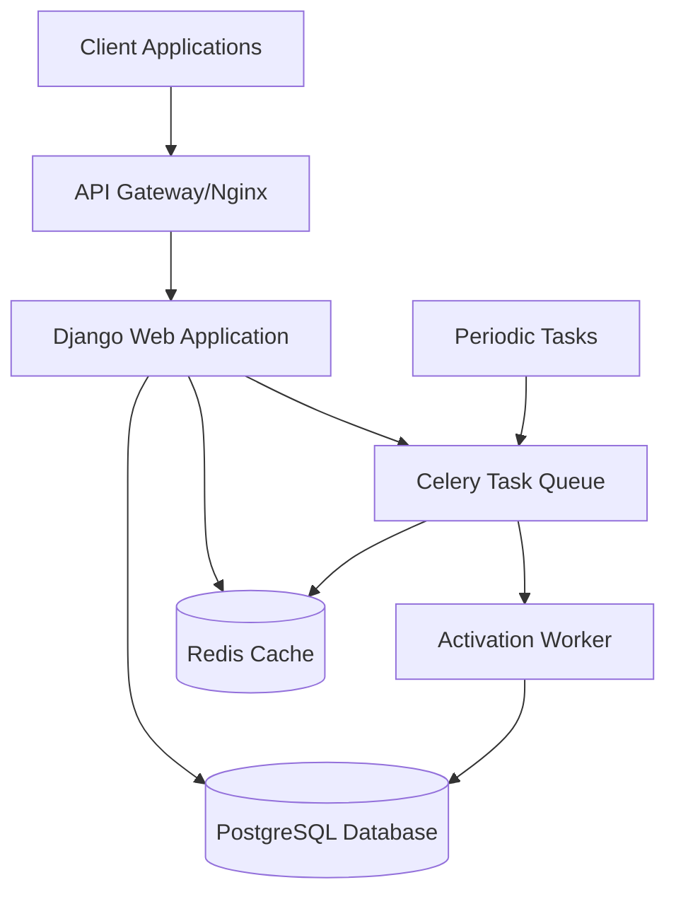
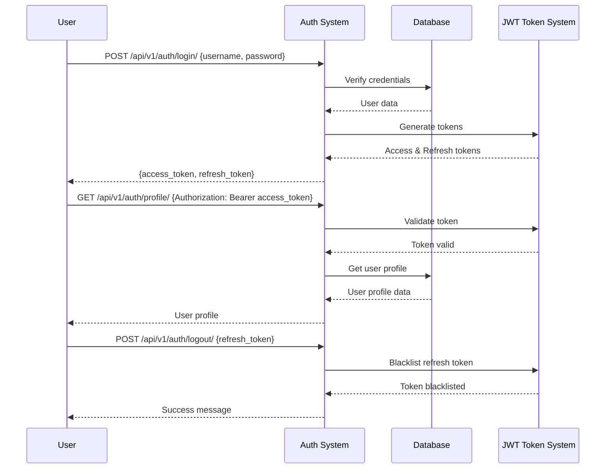
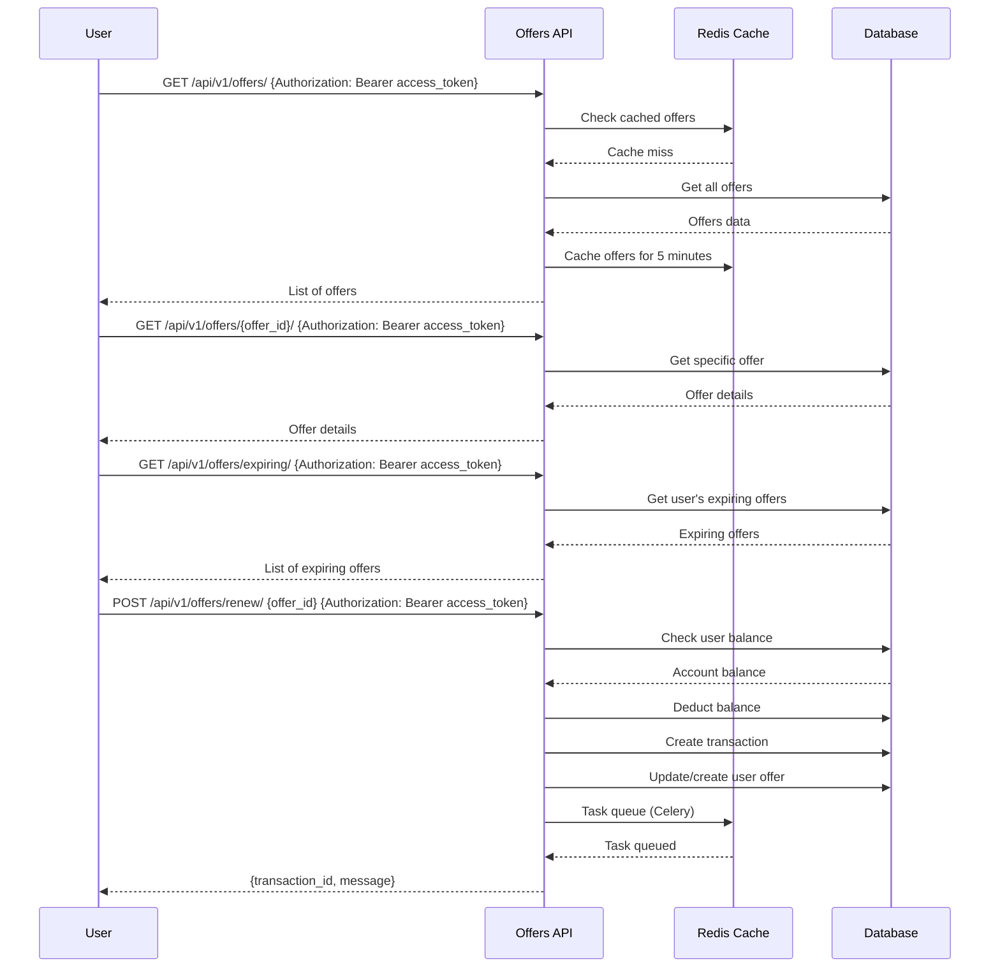
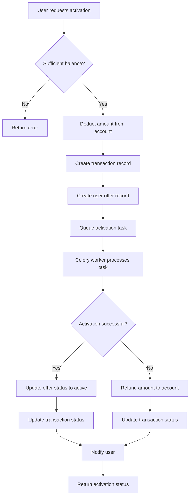
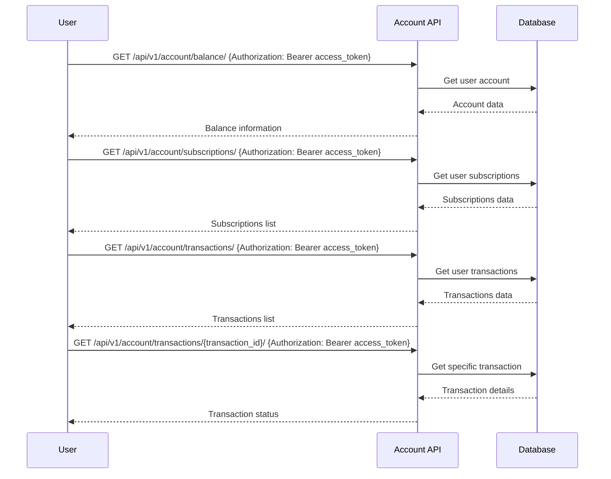

# Offers API Application Flow

This document describes the architecture and flow of the Offers API application, showing how different components interact with each other.

## Table of Contents
1. [System Architecture](#system-architecture)
2. [User Authentication Flow](#user-authentication-flow)
3. [Offer Management Flow](#offer-management-flow)
4. [Offer Activation Flow](#offer-activation-flow)
5. [Account Management Flow](#account-management-flow)
6. [Data Models](#data-models)

## System Architecture



The application follows a microservices-like architecture using Docker containers:
- **Web Application**: Django application serving REST API endpoints
- **Database**: PostgreSQL for persistent data storage
- **Cache**: Redis for caching frequently accessed data
- **Task Queue**: Redis as a message broker for Celery
- **Worker**: Celery worker for processing background tasks
- **Client**: Any client that can make HTTP requests (web, mobile, Postman, etc.)

## User Authentication Flow



## Offer Management Flow



## Offer Activation Flow



## Account Management Flow



## Data Models

### Offer Model
```python
class Offer(models.Model):
    name = models.CharField(max_length=100)
    description = models.TextField()
    price = models.DecimalField(max_digits=10, decimal_places=2)
    duration_days = models.IntegerField(help_text="Duration of the offer in days")
    is_active = models.BooleanField(default=True)
    created_at = models.DateTimeField(auto_now_add=True)
    updated_at = models.DateTimeField(auto_now=True)
```

### User Offer Model
```python
class UserOffer(models.Model):
    user = models.ForeignKey(User, on_delete=models.CASCADE)
    offer = models.ForeignKey(Offer, on_delete=models.CASCADE)
    activation_date = models.DateTimeField(auto_now_add=True)
    expiration_date = models.DateTimeField()
    is_active = models.BooleanField(default=True)
    transaction_id = models.CharField(max_length=100, unique=True)
```

### Account Model
```python
class Account(models.Model):
    user = models.OneToOneField(User, on_delete=models.CASCADE)
    balance = models.DecimalField(max_digits=10, decimal_places=2, default=0.00)
    created_at = models.DateTimeField(auto_now_add=True)
    updated_at = models.DateTimeField(auto_now=True)
```

### Transaction Model
```python
class Transaction(models.Model):
    TRANSACTION_STATUS_CHOICES = [
        ('PENDING', 'Pending'),
        ('SUCCESS', 'Success'),
        ('FAILED', 'Failed'),
    ]
    
    user = models.ForeignKey(User, on_delete=models.CASCADE)
    offer = models.ForeignKey(Offer, on_delete=models.CASCADE, null=True, blank=True)
    amount = models.DecimalField(max_digits=10, decimal_places=2)
    transaction_id = models.CharField(max_length=100, unique=True)
    status = models.CharField(max_length=20, choices=TRANSACTION_STATUS_CHOICES, default='PENDING')
    created_at = models.DateTimeField(auto_now_add=True)
    updated_at = models.DateTimeField(auto_now=True)
```

## Key Features

### 1. Authentication
- JWT-based authentication
- Token refresh capability
- Token blacklisting on logout

### 2. Offer Management
- List all available offers
- View specific offer details
- Cache frequently accessed offers
- Renew expiring offers

### 3. Account Management
- Balance tracking
- Subscription management
- Transaction history

### 4. Asynchronous Processing
- Offer activation processed in background
- Celery for task queuing
- Automatic retries on failure
- Status tracking for all operations

### 5. Data Integrity
- Database transactions for financial operations
- Concurrency handling with select_for_update
- Error handling and rollback mechanisms

## API Endpoints

### Authentication
- `POST /api/v1/auth/login/` - User login
- `POST /api/v1/auth/logout/` - User logout
- `GET /api/v1/auth/profile/` - Get user profile

### Offers
- `GET /api/v1/offers/` - List all offers
- `GET /api/v1/offers/{id}/` - Get specific offer
- `GET /api/v1/offers/expiring/` - Get expiring offers
- `POST /api/v1/offers/renew/` - Renew an offer

### Account
- `GET /api/v1/account/balance/` - Get account balance
- `GET /api/v1/account/subscriptions/` - Get user subscriptions
- `GET /api/v1/account/transactions/` - List transactions
- `GET /api/v1/account/transactions/{id}/` - Get transaction status

### Activation
- `POST /api/v1/activation/activate/` - Activate an offer
- `GET /api/v1/activation/status/{transaction_id}/` - Check activation status

## Error Handling

The application implements comprehensive error handling:
- Proper HTTP status codes
- Descriptive error messages
- Graceful degradation when services are unavailable
- Automatic rollback on transaction failures