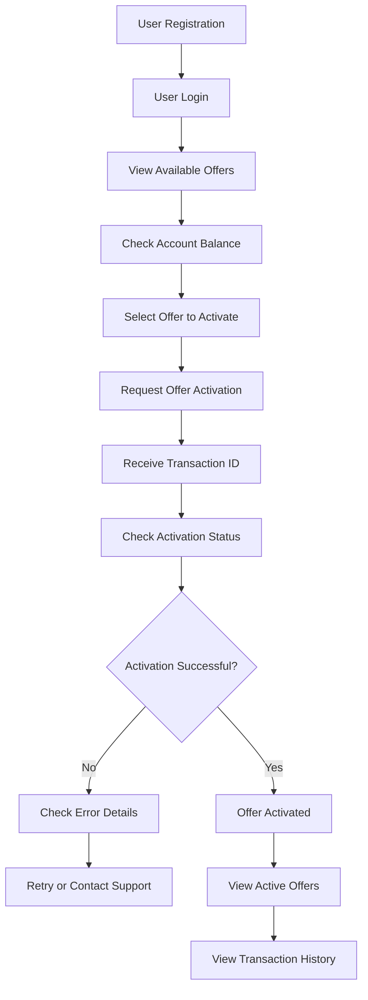
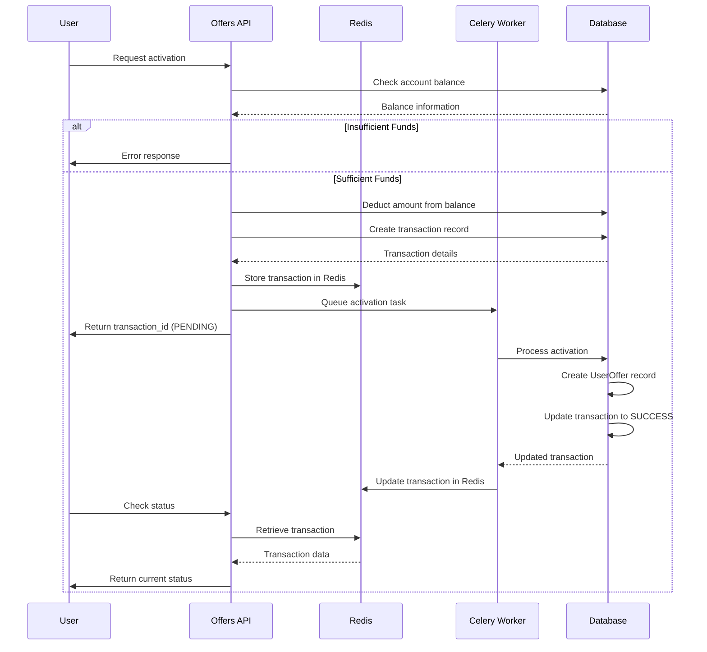

# User Journey Flowchart

This document provides a visual representation of the typical user journey when using the Offers API application. It's designed to be easily understood by clients and end users who interact with the system.

## Complete User Journey

The following flowchart shows the complete user journey from account creation to offer activation:



## Step-by-Step Description

### 1. User Registration
Before using the system, users need to create an account. This is typically done by the system administrator or through a separate registration process. Each user will have:
- Username and password
- Associated account with balance
- Access to available offers

### 2. User Login
Users authenticate with the system using the authentication API:
```
POST /api/v1/auth/login/
```
With credentials:
```json
{
  "username": "your_username",
  "password": "your_password"
}
```

Upon successful authentication, the system returns access and refresh tokens that are used for subsequent API calls.

### 3. View Available Offers
Users can browse all available offers:
```
GET /api/v1/offers/
```

Each offer includes:
- Name and description
- Price
- Duration in days

### 4. Check Account Balance
Users can check their account balance and active subscriptions:
```
GET /api/v1/account/
```

This helps users determine if they have sufficient funds to activate an offer.

### 5. Select Offer to Activate
After reviewing available offers and checking their account balance, users select an offer they want to activate.

### 6. Request Offer Activation
Users initiate the activation process by calling:
```
POST /api/v1/activation/
```

With the offer ID:
```json
{
  "offer_id": 1
}
```

### 7. Receive Transaction ID
The system responds with a transaction ID and PENDING status:
```json
{
  "transaction_id": "uuid-string",
  "status": "PENDING"
}
```

This transaction ID is used to track the activation process.

### 8. Check Activation Status
Users can check the status of their activation request:
```
GET /api/v1/activation/status/{transaction_id}/
```

The system will return the current status:
```json
{
  "transaction_id": "uuid-string",
  "status": "SUCCESS", // or "PENDING", "FAILED"
  "created_at": "timestamp",
  "updated_at": "timestamp"
}
```

### 9. Activation Result Handling
Depending on the activation result:
- **Successful**: The offer is activated and added to the user's active offers
- **Failed**: Users can check error details and either retry or contact support

### 10. View Active Offers
Users can see their active offers:
```
GET /api/v1/account/
```

### 11. View Transaction History
Users can review their transaction history:
```
GET /api/v1/account/transactions/
```

## Detailed Activation Process

The activation process involves several backend steps that are transparent to the user:



## Key Points for Users

1. **Authentication**: All API requests require a valid access token
2. **Balance Management**: Ensure sufficient balance before activating offers
3. **Transaction Tracking**: Use the transaction ID to track activation status
4. **Asynchronous Processing**: Activation happens asynchronously, so check status periodically
5. **Error Handling**: If an activation fails, funds are automatically refunded to your account

## Common User Actions

| Action | API Endpoint | Purpose |
|--------|--------------|---------|
| Login | `POST /api/v1/auth/login/` | Authenticate with the system |
| View Offers | `GET /api/v1/offers/` | Browse available offers |
| Check Account | `GET /api/v1/account/` | View balance and active offers |
| Activate Offer | `POST /api/v1/activation/` | Request activation of an offer |
| Check Status | `GET /api/v1/activation/status/{id}/` | Check activation progress |
| View Transactions | `GET /api/v1/account/transactions/` | Review transaction history |

This user journey provides a complete overview of how to interact with the Offers API system from a client perspective.