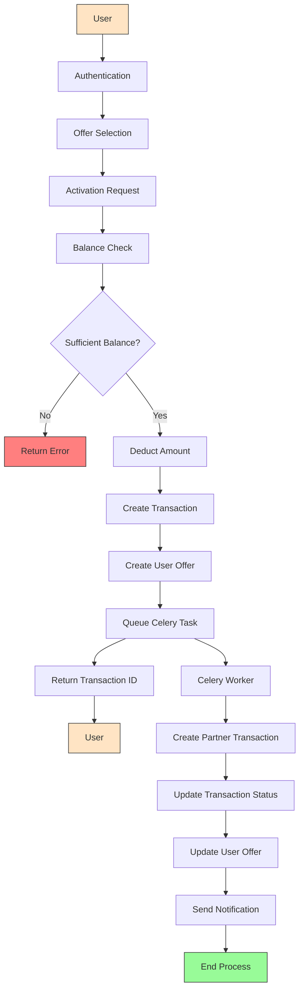
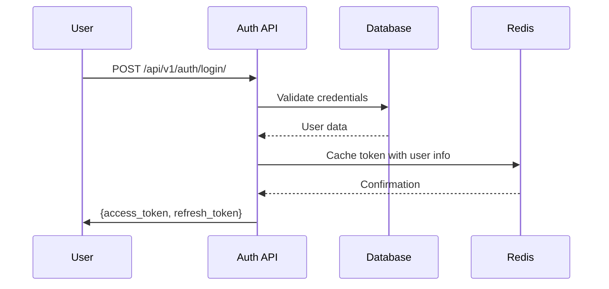
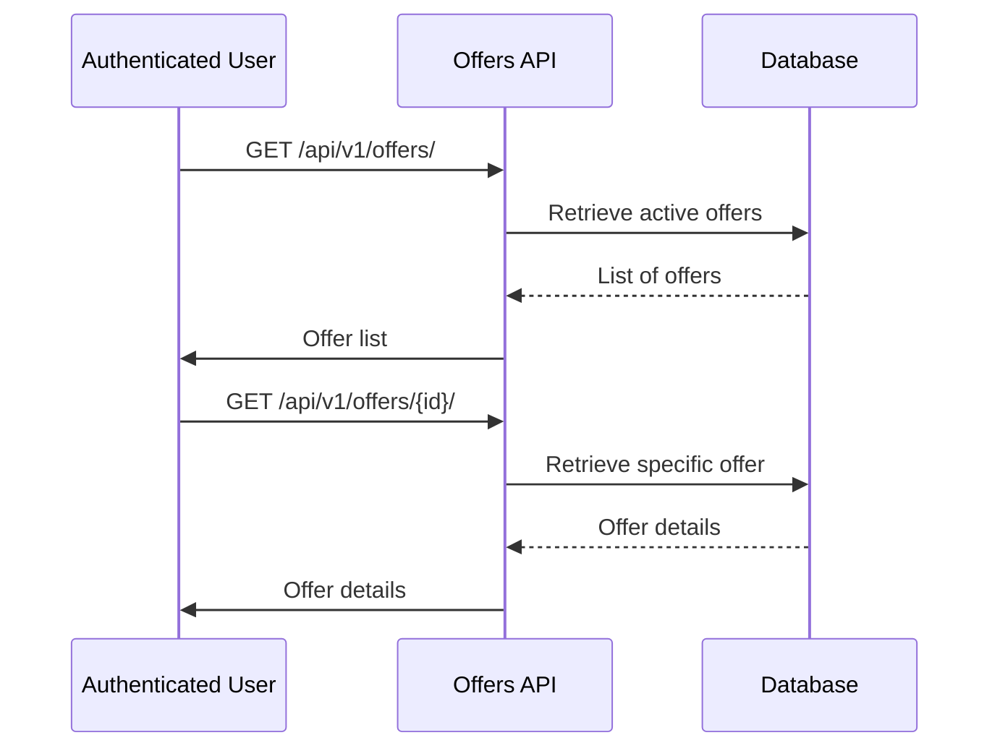
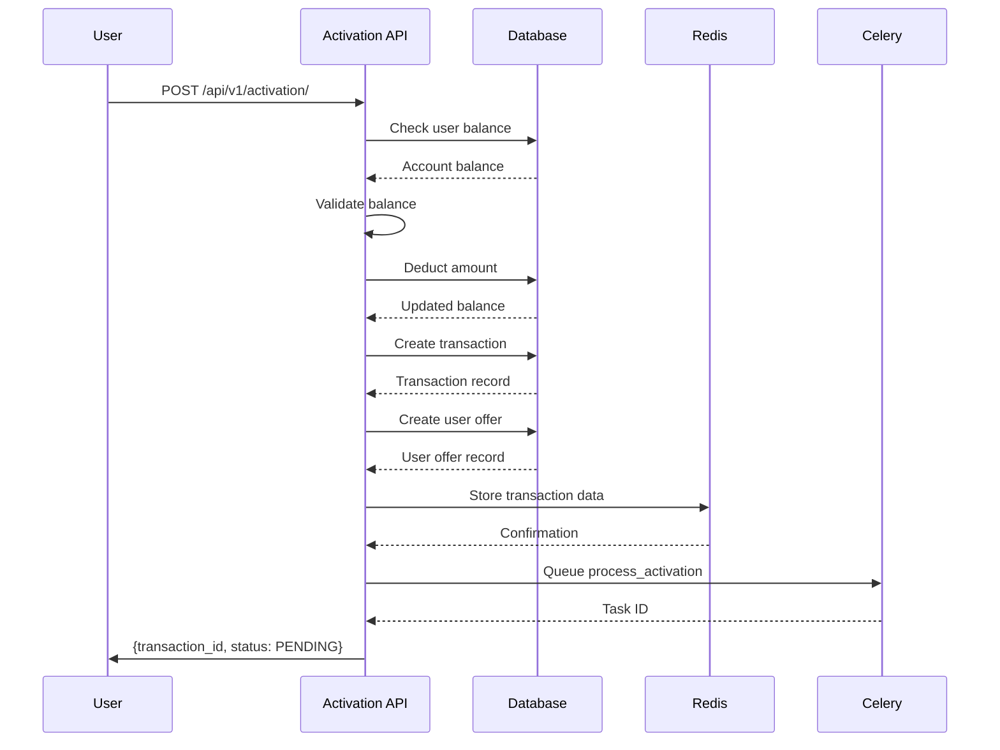
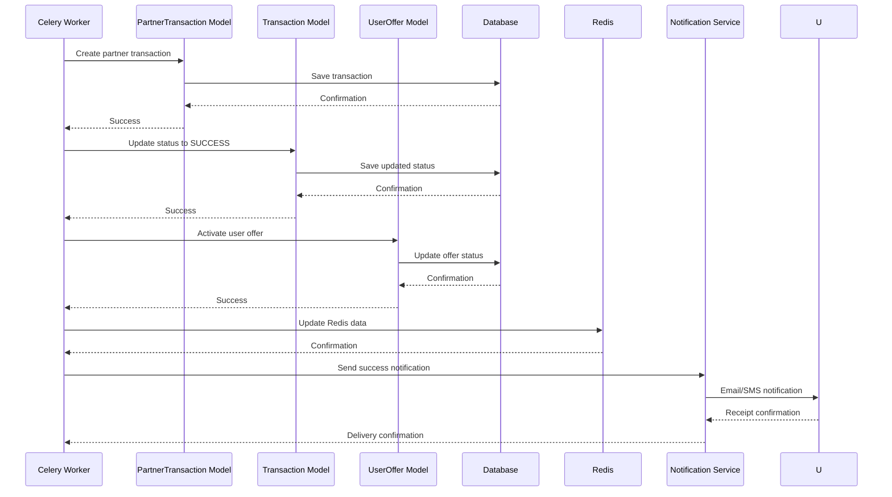
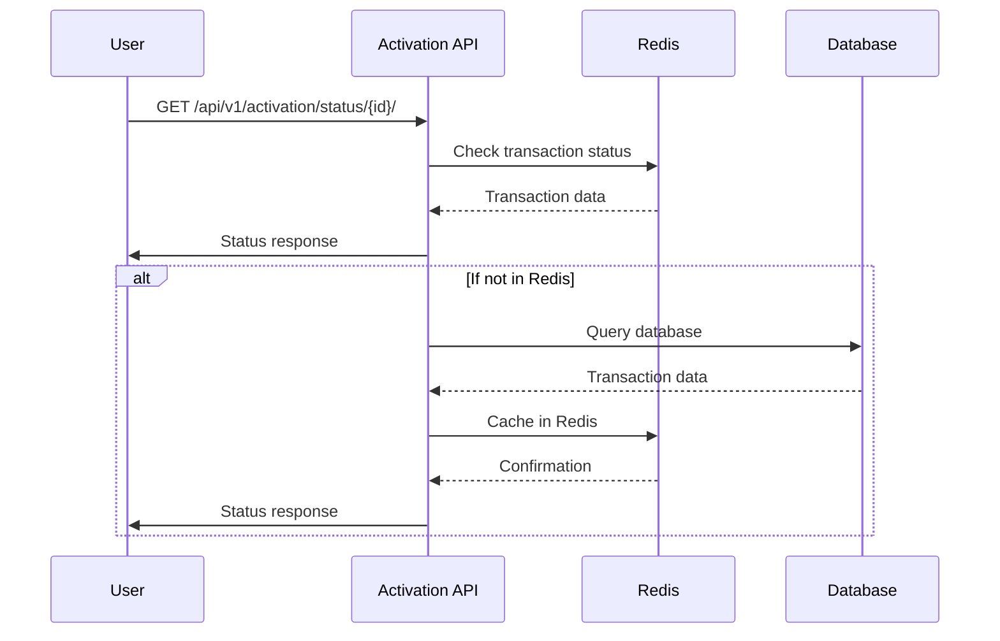
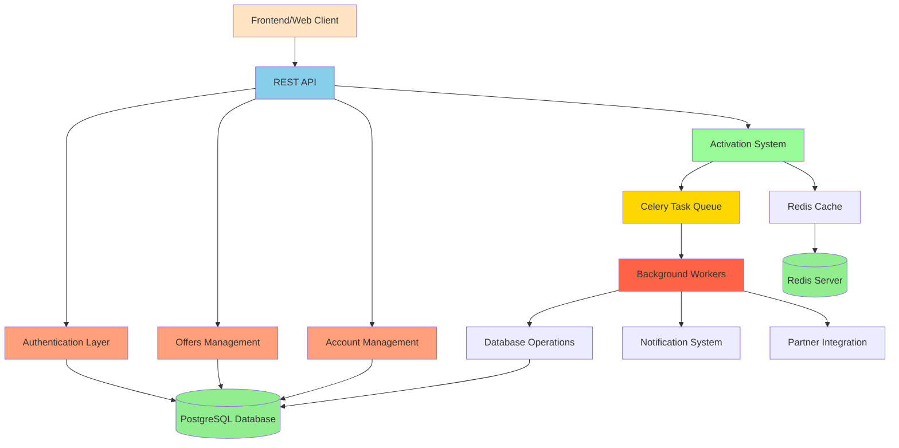
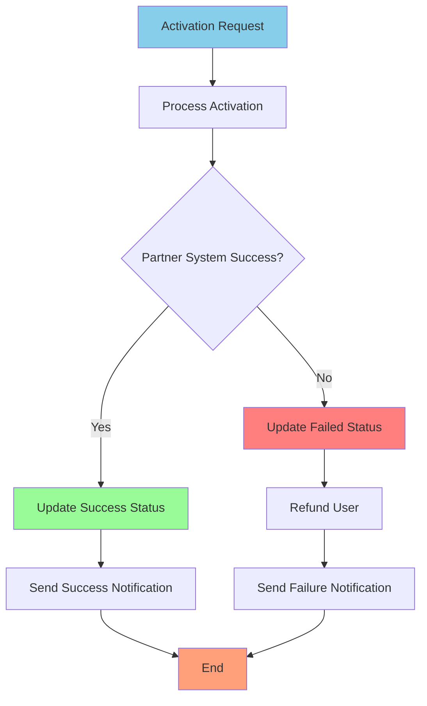

# Offer Activation Process Flowchart

This document provides a visual representation of the offer activation process in the Offers API system, showing how different components interact at each step.

## Complete Activation Flow

## Step-by-Step Process Details

### Step 1: User Authentication

### Step 2: Offer Selection

### Step 3: Activation Request Processing

### Step 4: Background Processing by Celery

### Final: Status Checking

## Component Interaction Overview

## Error Handling Flow

## Data Flow Summary

1. **User Authentication**:
   - User provides credentials
   - System validates against database
   - JWT tokens generated and cached in Redis

2. **Offer Browsing**:
   - User requests list of available offers
   - System retrieves from database
   - Returns filtered list to user

3. **Activation Request**:
   - User selects offer to activate
   - System checks account balance
   - If sufficient, deducts amount
   - Creates transaction and user offer records
   - Stores data in Redis
   - Queues Celery task for background processing
   - Returns transaction ID to user

4. **Background Processing**:
   - Celery worker processes activation task
   - Creates partner transaction record
   - Updates transaction status to SUCCESS
   - Activates user offer
   - Updates Redis cache
   - Sends notification to user

5. **Status Checking**:
   - User requests activation status
   - System first checks Redis cache
   - Falls back to database if not in cache
   - Returns current status to user

This flow ensures a smooth, secure, and scalable activation process with proper error handling and user feedback at every step.