# System Flowcharts for Offers API

This document provides comprehensive flowcharts illustrating all possible scenarios in the Offers API system, including the standard user flows and the newly added partner module flows.

## Table of Contents
1. [Complete System Architecture](#complete-system-architecture)
2. [User Authentication Flow](#user-authentication-flow)
3. [Offer Management Flow](#offer-management-flow)
4. [Account Management Flow](#account-management-flow)
5. [Standard Activation Flow](#standard-activation-flow)
6. [Partner Activation Flow](#partner-activation-flow)
7. [Transaction Status Checking Flow](#transaction-status-checking-flow)
8. [Expiring Offers Notification Flow](#expiring-offers-notification-flow)

## Complete System Architecture

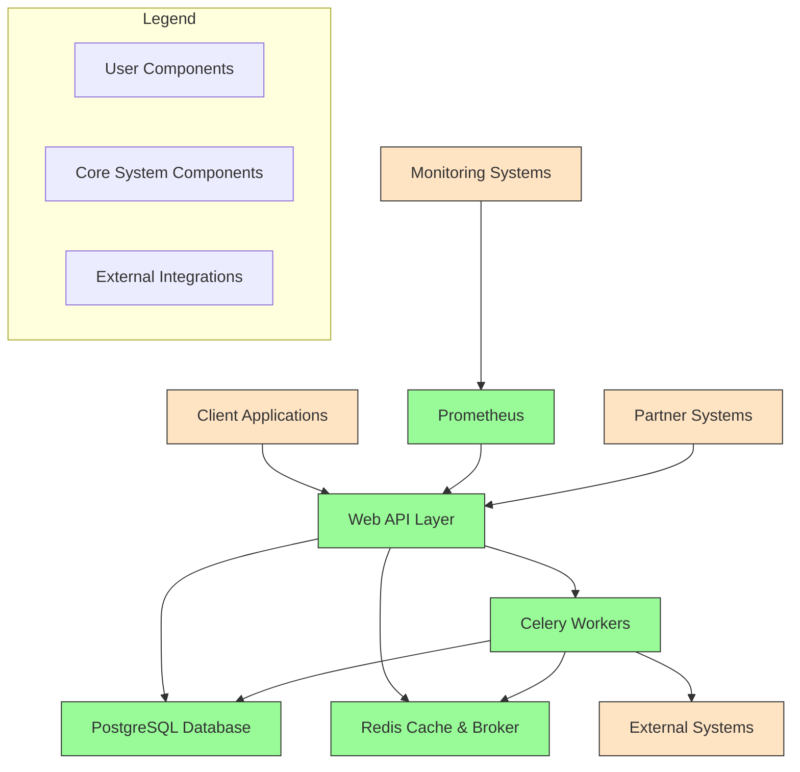

## User Authentication Flow

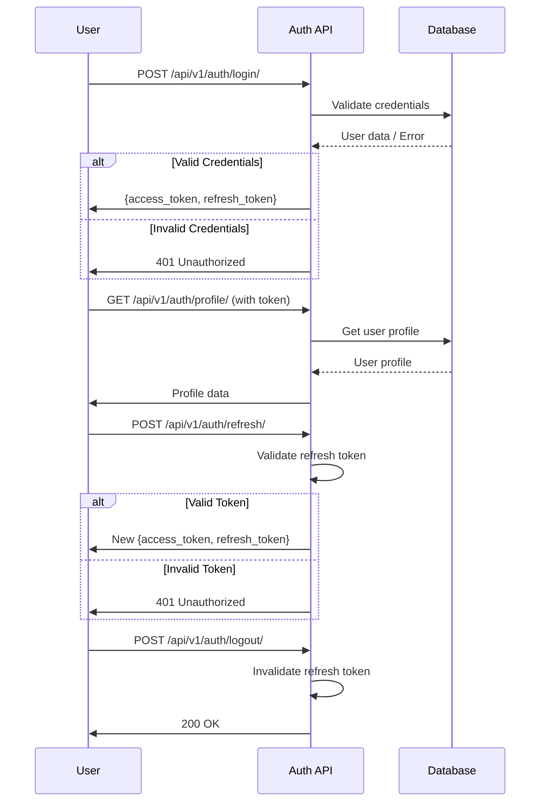

## Offer Management Flow

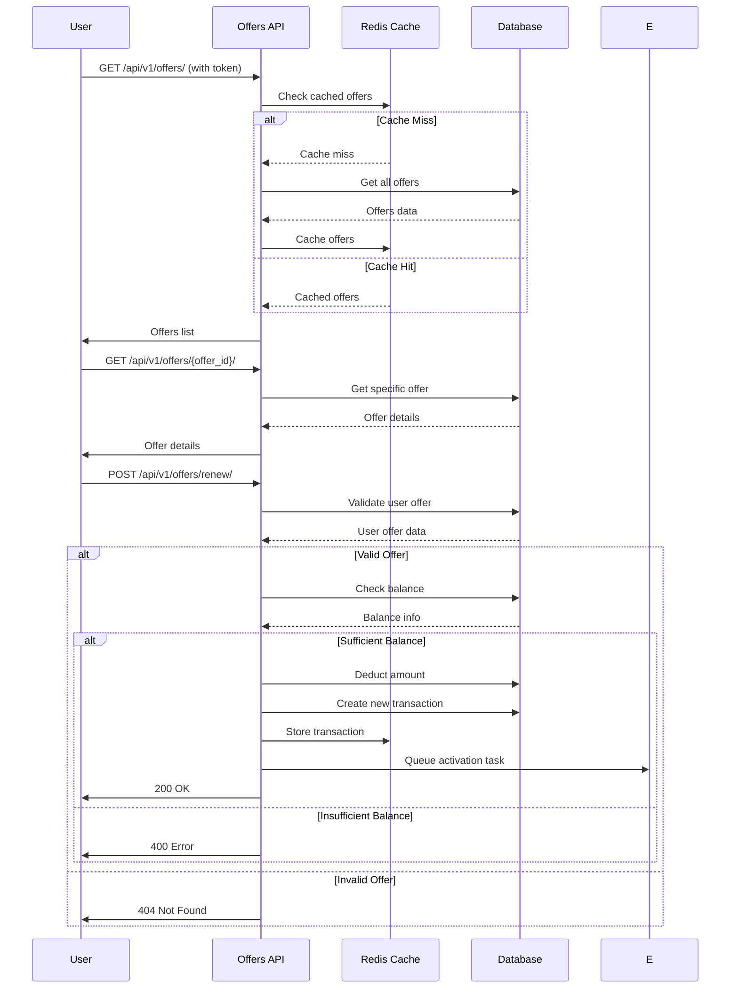

## Account Management Flow

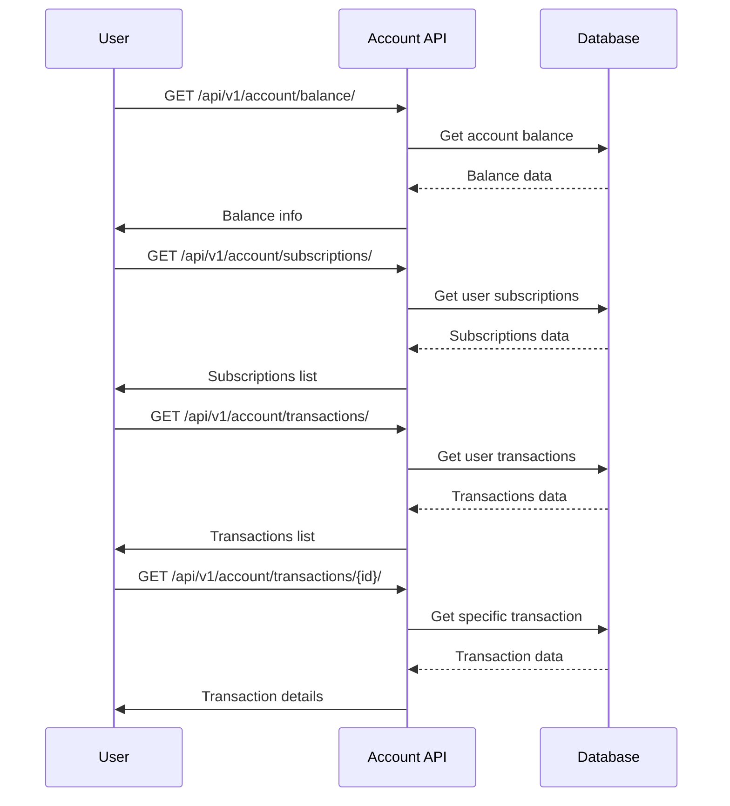

## Standard Activation Flow

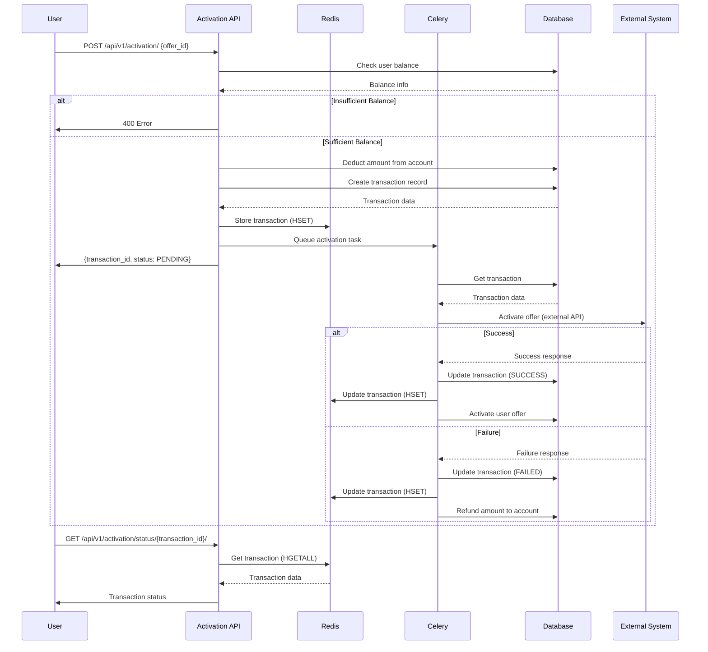

## Partner Activation Flow

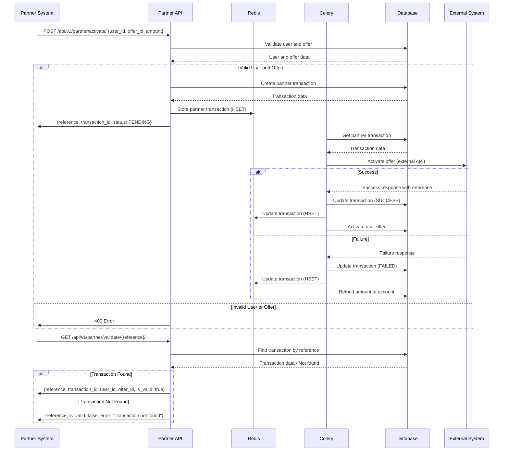

## Transaction Status Checking Flow

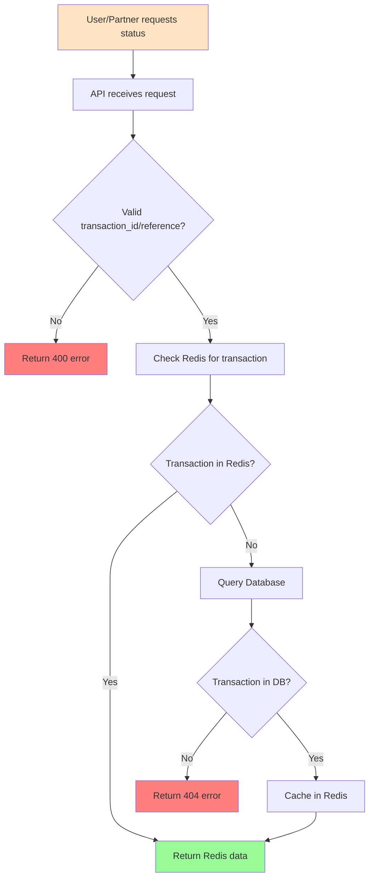

## Expiring Offers Notification Flow

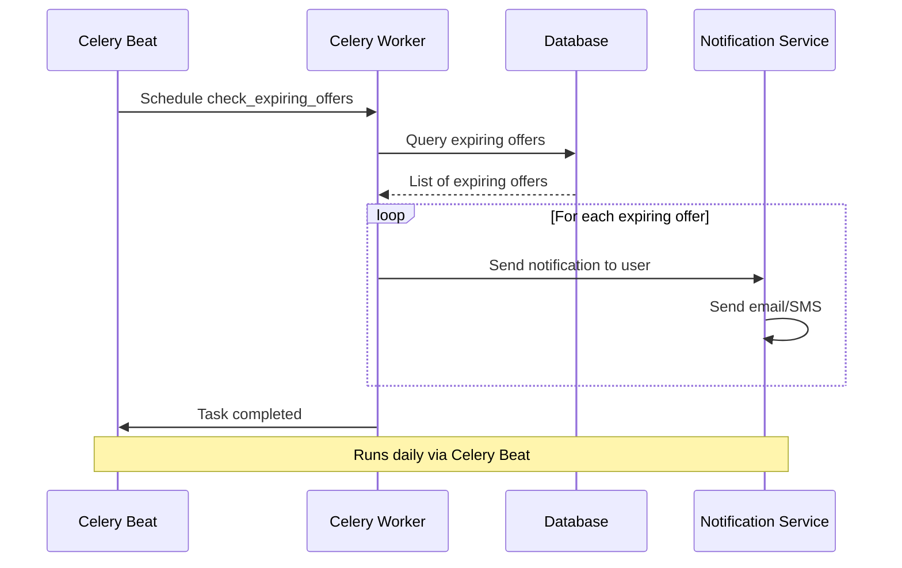

## Error Handling and Recovery Flows

### Activation Task Failure Recovery

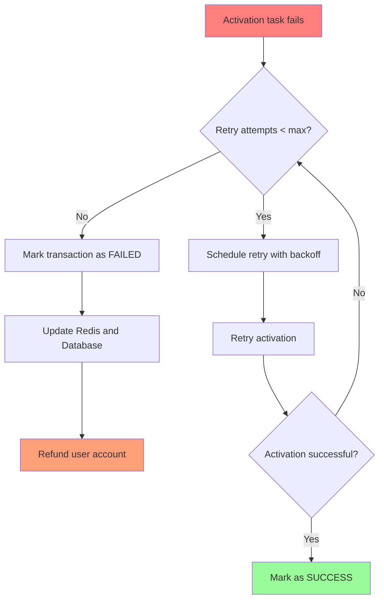

### Database Connection Failure

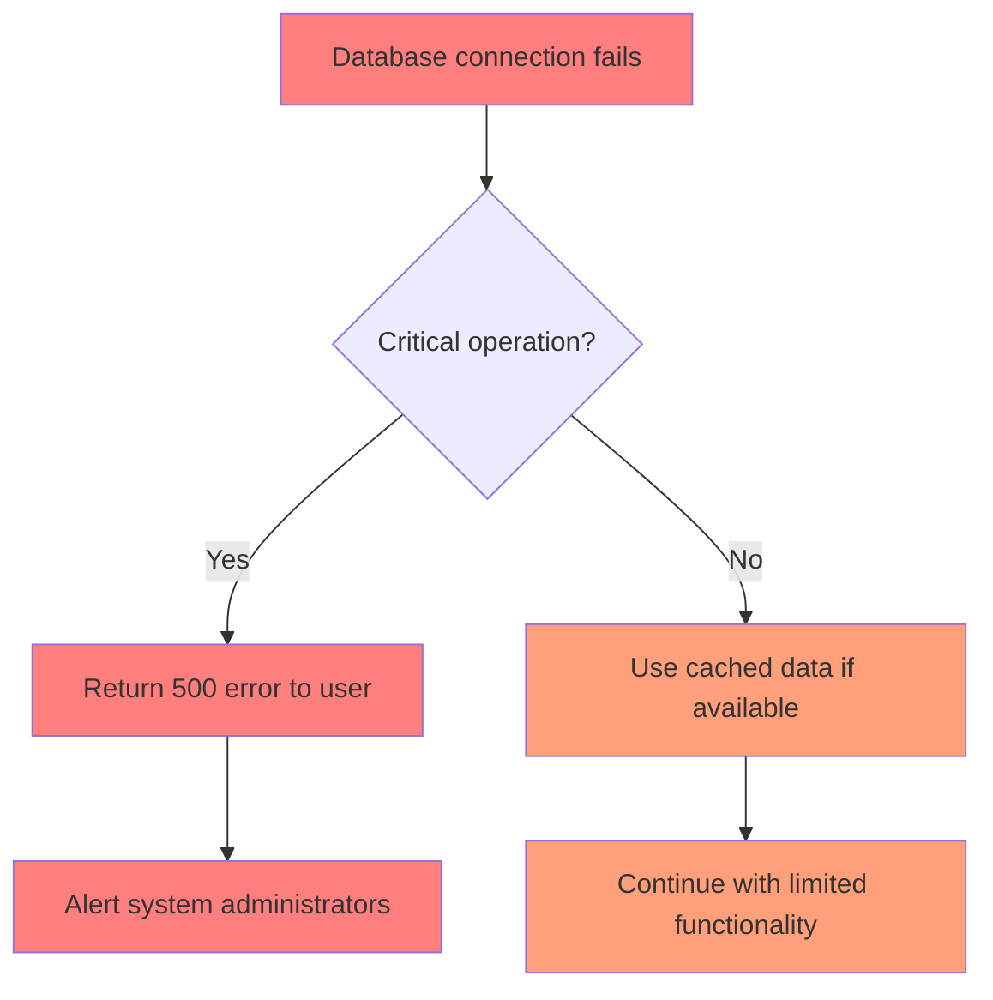

## Data Flow Summary

### Transaction Data Flow

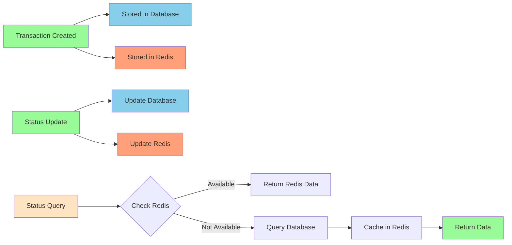

This comprehensive set of flowcharts illustrates all the major scenarios in the Offers API system, including both standard user flows and the new partner module flows. The diagrams show how data flows between components, how errors are handled, and how the system maintains consistency between the database and Redis cache.