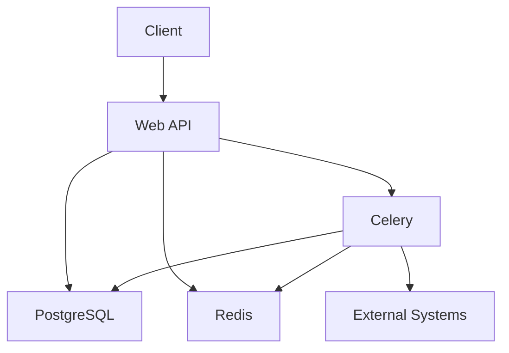

# Technical Documentation

This document provides technical details about the implementation of the Offers API system, with a focus on Redis data handling, Celery tasks, and system architecture.

## Table of Contents
1. [System Architecture](#system-architecture)
2. [Redis Implementation](#redis-implementation)
3. [Celery Tasks](#celery-tasks)
4. [Data Models](#data-models)
5. [API Endpoints](#api-endpoints)

## System Architecture

The Offers API follows a microservices-inspired architecture with the following components:



For a more detailed architecture diagram including the partner module and all system flows, please refer to the [SYSTEM_FLOWCHARTS.md](SYSTEM_FLOWCHARTS.md) document.

### Component Descriptions

1. **Web API (Django)**: Main application handling HTTP requests
2. **PostgreSQL**: Primary database for persistent data storage
3. **Redis**: 
   - Cache for offer data
   - Message broker for Celery
   - Transaction status storage
4. **Celery**: Asynchronous task processing
5. **External Systems**: Simulated external activation systems

## Redis Implementation

### Hash-based Transaction Storage

Instead of using simple string values with GET/SET operations, we use Redis hashes for storing transaction data. This approach provides several benefits:

1. **Structured Data Storage**: Each field can be accessed individually
2. **Efficient Updates**: Only changed fields need to be updated
3. **Atomic Operations**: HSET and HGETALL operations are atomic
4. **Memory Efficiency**: More efficient than serialized JSON strings

### Implementation Details

#### Storing Transactions

```python
# In activation/views.py
transaction_data = {
    'transaction_id': str(transaction_id),
    'user_id': str(request.user.id),
    'offer_id': str(offer.id),
    'amount': str(offer.price),
    'status': 'PENDING',
    'created_at': str(timezone.now()),
    'updated_at': str(timezone.now())
}

# Using HSET with mapping to store the entire hash
redis_client.hset(f"transaction:{transaction_id}", mapping=transaction_data)
```

#### Updating Transaction Status

```python
# In activation/tasks.py
# Update only the status and updated_at fields
redis_client.hset(f"transaction:{transaction_id}", mapping={
    'status': 'SUCCESS',
    'updated_at': str(timezone.now())
})
```

#### Retrieving Transaction Data

```python
# In activation/views.py
# Retrieve all fields with HGETALL
transaction_data = redis_client.hgetall(f"transaction:{transaction_id}")
```

### Advantages over String-based Storage

#### Traditional String Approach (Not Used)
```python
# This approach is NOT used in our implementation
import json

# Storing
transaction_data = {
    'transaction_id': str(transaction_id),
    'user_id': str(request.user.id),
    'offer_id': str(offer.id),
    'amount': str(offer.price),
    'status': 'PENDING',
    'created_at': str(timezone.now()),
    'updated_at': str(timezone.now())
}

redis_client.set(f"transaction:{transaction_id}", json.dumps(transaction_data))

# Retrieving
transaction_json = redis_client.get(f"transaction:{transaction_id}")
transaction_data = json.loads(transaction_json)
```

#### Hash-based Approach (Used)
```python
# This is the approach we use
# Storing
redis_client.hset(f"transaction:{transaction_id}", mapping={
    'transaction_id': str(transaction_id),
    'user_id': str(request.user.id),
    'offer_id': str(offer.id),
    'amount': str(offer.price),
    'status': 'PENDING',
    'created_at': str(timezone.now()),
    'updated_at': str(timezone.now())
})

# Retrieving
transaction_data = redis_client.hgetall(f"transaction:{transaction_id}")

# Updating specific fields
redis_client.hset(f"transaction:{transaction_id}", mapping={
    'status': 'SUCCESS',
    'updated_at': str(timezone.now())
})
```

### Benefits of Hash-based Approach

1. **Partial Updates**: Only changed fields are updated, reducing network traffic
2. **No Serialization Overhead**: Values are stored as strings, eliminating JSON parsing
3. **Individual Field Access**: Can retrieve or update specific fields without affecting others
4. **Better Performance**: HGETALL is more efficient than JSON parsing
5. **Atomic Operations**: HSET operations are atomic

## Celery Tasks

### Activation Task

The activation task ([process_activation](file:///c%3A/Users/alain/Pictures/Offers%20API/activation/tasks.py#L23-L118)) is responsible for processing offer activations asynchronously:

1. Update transaction status to PROCESSING
2. Call external system to activate the offer
3. Handle success or failure cases
4. Update transaction status accordingly
5. Send notifications to the user

```python
@shared_task
def process_activation(transaction_id):
    # Implementation details...
```

### Expiring Offers Check Task

The [check_expiring_offers](file:///c%3A/Users/alain/Pictures/Offers%20API/activation/tasks.py#L144-L177) task runs daily to notify users about expiring offers:

1. Query database for offers expiring in the next 3 days
2. Send notifications to affected users

```python
@shared_task
def check_expiring_offers():
    # Implementation details...
```

### Task Monitoring and Retry Logic

Tasks are designed with robust error handling and retry mechanisms:

1. All tasks are logged for monitoring
2. Failures are gracefully handled with appropriate status updates
3. Failed activations are refunded to user accounts
4. Redis is kept in sync with database during all operations

## Data Models

For a comprehensive view of all model relationships in the system, please refer to the [MODEL_DIAGRAM.md](MODEL_DIAGRAM.md) document.

### User Model

The standard Django User model is used with additional account information:

```python
# Django's built-in User model
class User(models.Model):
    username = models.CharField(max_length=150)
    email = models.EmailField()
    # ... other fields
```

### Account Model

The Account model stores user balance information:

```python
class Account(models.Model):
    user = models.OneToOneField(User, on_delete=models.CASCADE)
    balance = models.DecimalField(max_digits=10, decimal_places=2, default=0.00)
```

### Offer Model

The Offer model represents available offers:

```python
class Offer(models.Model):
    name = models.CharField(max_length=100)
    description = models.TextField()
    price = models.DecimalField(max_digits=10, decimal_places=2)
    duration_days = models.IntegerField(help_text="Duration of the offer in days")
    is_active = models.BooleanField(default=True)
```

### UserOffer Model

The UserOffer model represents activated offers for users:

```python
class UserOffer(models.Model):
    user = models.ForeignKey(User, on_delete=models.CASCADE)
    offer = models.ForeignKey(Offer, on_delete=models.CASCADE)
    activation_date = models.DateTimeField(auto_now_add=True)
    expiration_date = models.DateTimeField()
    is_active = models.BooleanField(default=True)
    transaction_id = models.CharField(max_length=100, unique=True)
```

### Transaction Model

The Transaction model tracks all financial transactions:

```python
class Transaction(models.Model):
    TRANSACTION_STATUS_CHOICES = [
        ('PENDING', 'Pending'),
        ('PROCESSING', 'Processing'),
        ('SUCCESS', 'Success'),
        ('FAILED', 'Failed'),
    ]
    
    transaction_id = models.CharField(max_length=100, unique=True)
    user = models.ForeignKey(User, on_delete=models.CASCADE)
    offer = models.ForeignKey(Offer, on_delete=models.CASCADE)
    amount = models.DecimalField(max_digits=10, decimal_places=2)
    status = models.CharField(max_length=20, choices=TRANSACTION_STATUS_CHOICES, default='PENDING')
    created_at = models.DateTimeField(auto_now_add=True)
    updated_at = models.DateTimeField(auto_now=True)
    completed_at = models.DateTimeField(null=True, blank=True)
```

### PartnerTransaction Model

The PartnerTransaction model tracks transactions initiated by partner systems:

```python
class PartnerTransaction(models.Model):
    transaction_id = models.CharField(max_length=100, unique=True)
    reference = models.CharField(max_length=100, unique=True)
    user = models.ForeignKey(User, on_delete=models.CASCADE)
    offer = models.ForeignKey(Offer, on_delete=models.CASCADE)
    amount = models.DecimalField(max_digits=10, decimal_places=2)
    status = models.CharField(max_length=20, choices=Transaction.TRANSACTION_STATUS_CHOICES, default='PENDING')
    created_at = models.DateTimeField(auto_now_add=True)
    updated_at = models.DateTimeField(auto_now=True)
```

## API Endpoints

### Authentication Endpoints

- `POST /api/v1/auth/login/` - User login
- `GET /api/v1/auth/profile/` - Get user profile
- `POST /api/v1/auth/refresh/` - Refresh access token
- `POST /api/v1/auth/logout/` - User logout

### Offer Endpoints

- `GET /api/v1/offers/` - List all offers
- `GET /api/v1/offers/{id}/` - Get specific offer details
- `GET /api/v1/offers/expiring/` - Get user's expiring offers
- `POST /api/v1/offers/renew/` - Renew an offer

### Account Endpoints

- `GET /api/v1/account/balance/` - Get account balance
- `GET /api/v1/account/subscriptions/` - Get user subscriptions
- `GET /api/v1/account/transactions/` - List transactions
- `GET /api/v1/account/transactions/{id}/` - Get transaction details

### Activation Endpoints

- `POST /api/v1/activation/` - Activate an offer
- `GET /api/v1/activation/status/{id}/` - Check activation status

### Partner Endpoints

- `POST /api/v1/partner/activate/` - Partner activation request
- `GET /api/v1/partner/validate/{reference}/` - Validate transaction by reference